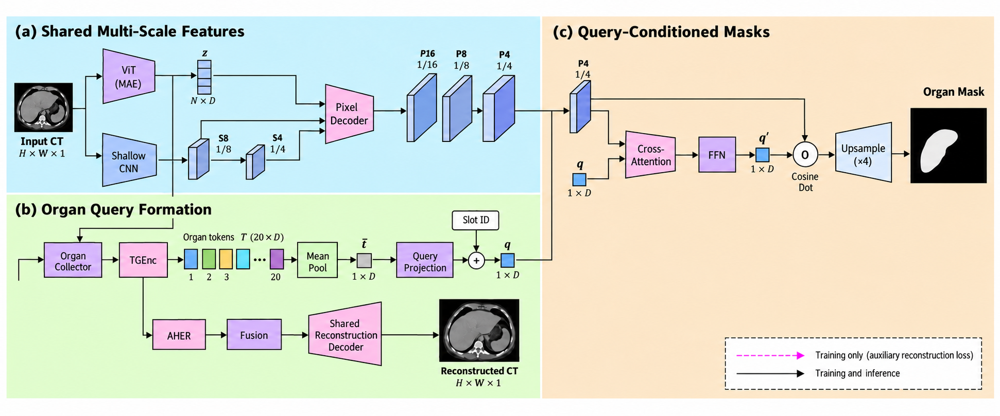
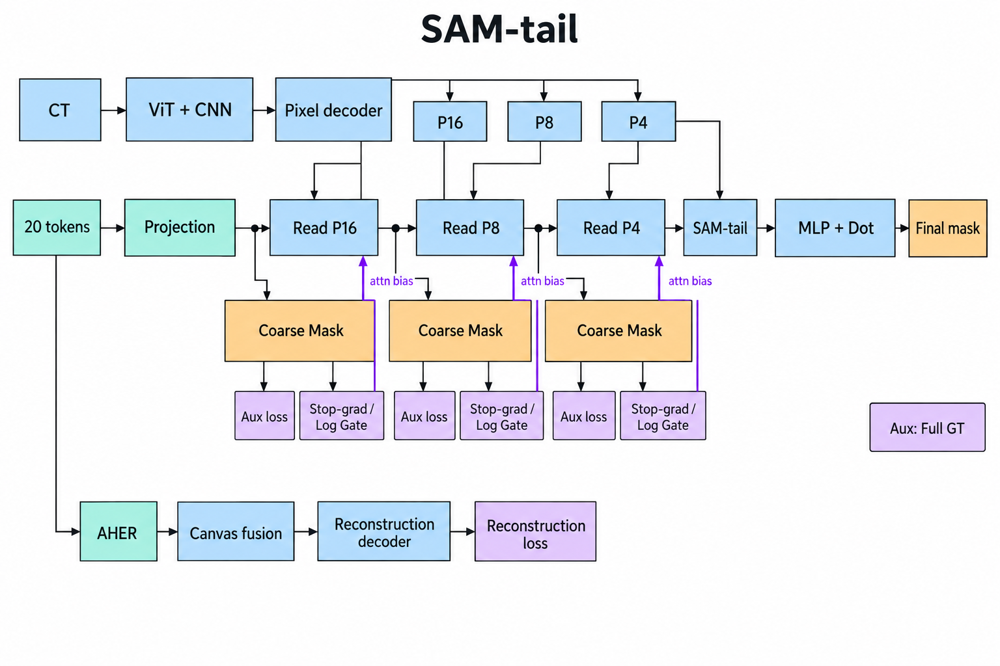
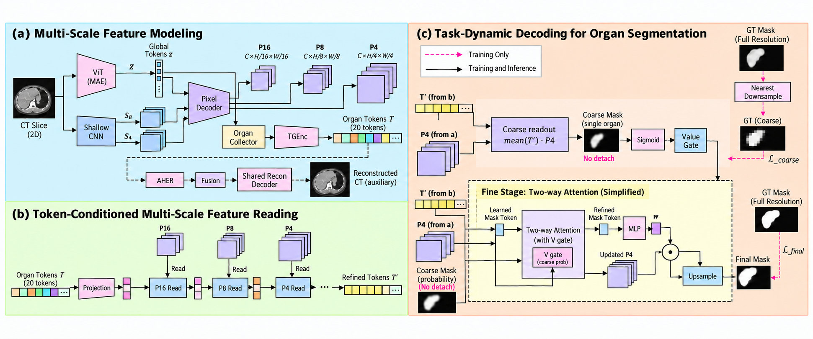

# OrganSlot

共享ViT＋器官独立tokens＋共享空间分支的分割/重建框架。后续仅保留以下三个2D主线配置。
架构图为按代码绘制的AI生成示意图，PNG供GitHub预览，PDF供下载；不是SAM/H-SAM官方复刻。
使用内置image_gen生成（工具未提供image2.5版本选择）；[重绘提示词记录](docs/figures/redraw_prompts.json)。
采用纯白、柔和配色、英文短标签的扁平矢量风格；文件本身仍是栅格图，PDF非可编辑矢量。

## 三个配置的正式指标

### 最新汇总：E cross＋MAE三次同协议随机划分（2026-10-08）

**主指标：固定0.5平均Dice 85.62%，验证集校准平均Dice 86.22%。**
使用官方池划分seed0/1/42，分别独立训练；每次96例训练、26例验证、24例测试，
模型seed均为0。以下为三次八类病例Dice均值的等权算术平均，不合并重复病例。
这是重复随机划分评估，不是三折交叉验证：seed0/1、0/42、1/42分别有13、10、11例
共同测试病例。旧划分及替换5病例的探索性评估不纳入主均值。

| E cross＋MAE encoder配置 | 训练Job | 测试病例／切片 | 阈值校准数据 | 固定0.5 | 校准后 |
|---|---|---|---|---:|---:|
| 官方池seed42 | 2998655，bolinren19/SIP | 24／7315 | 独立26例验证集 | 84.95 | 85.64 |
| 官方池seed0 | 3006796，bolinren19/SIP | 24／6854 | 独立26例验证集 | 85.20 | 85.57 |
| 官方池seed1 | 3006797，bolinren19/SIP | 24／7079 | 独立26例验证集 | 86.71 | 87.44 |
| **官方池三次划分平均（同协议）** | seed42/0/1等权 | 非互斥测试集 | 验证集校准 | **85.62** | **86.22** |

八类校准Dice：

| 器官 | 旧划分 | seed42 | seed0 | seed1 |
|---|---:|---:|---:|---:|
| 脾脏 | 94.74 | 94.07 | 94.71 | 94.92 |
| 右肾 | 94.62 | 93.72 | 94.22 | 95.21 |
| 左肾 | 94.46 | 93.93 | 94.52 | 94.69 |
| 胆囊 | 62.34 | 69.63 | 69.92 | 74.64 |
| 食管 | 78.00 | 71.72 | 70.80 | 75.40 |
| 胰腺 | 77.29 | 78.91 | 77.39 | 80.91 |
| 肝脏 | 95.29 | 95.72 | 95.67 | 96.17 |
| 胃 | 86.13 | 87.43 | 87.34 | 87.61 |

### SOTA数值汇总（按展示值降序，协议不同，不是公平胜负排名）

| 方法 | 校准Dice展示值 | 汇总口径 |
|---|---:|---|
| E cross＋MAE encoder | **86.22** | 官方池seed0/1/42三次同协议随机划分平均 |
| SAM soft prior＋aux | 85.55 | 旧划分单次，尚未完成相同三次划分 |
| SAM两阶段mask、缩小GT监督 | 85.23 | 旧划分单次，尚未完成相同三次划分 |

不能凭这张混合协议汇总表断言E优于SAM。严格同旧划分的E仍为85.36，
下方消融排序保留原单次值。PCDD Offline85.47是外部论文参考，未核实相同
病例划分，不能据86.22宣称同协议超过。正式方法比较应使用所有方法相同
划分集合的均值。

单列记录（不参与上述均值）：旧划分训练148833固定84.30%、校准85.36%，
采用训练集前6000切片校准；替换5个badcase的评估复用该checkpoint，
属于测试病例组成的探索性分析，不是独立重训，也不纳入主排序。

结果来源：旧划分路径见下方；seed42为仓库根
`artifacts/offline_eval_recovery_20261005/evaluation/ArmE_CrossAttn_MAEenc_Official96_2998655_heads_test/results.json`；
seed0/1为`.worktrees/offline_splits_d553bc7/Results/OrganSlotBank/evaluation/Common8/WORD_2D/ArmE_CrossAttn_MAEenc_Official96_{3006796,3006797}_heads_test/results.json`。
均读取`binary_post/selected_post.foreground_mean_case_dice_presence_mean`的未舍入值求平均。

### 旧划分同协议比较

**旧24例测试划分、6990张切片、checkpoint-802、MAE encoder-only**。Dice单位%，
按病例计算再按八个前景器官平均，固定/校准结果均后处理。校准使用训练集前6000切片，
不是测试GT调参，也不是独立验证集校准。单seed，不能据微小差距声称稳定优势。

| 主线 | 固定0.5 | 校准后 | 训练Job / 账号集群 |
|---|---:|---:|---|
| E cross-attention | 84.30 | 85.36 | 148833 / sifansong-XEC |
| SAM-tail＋soft prior＋aux | **84.86** | **85.55** | 150971 / sifansong-XEC |
| SAM-tail＋两阶段mask、缩小GT监督 | 84.41 | 85.23 | 2998657 / bolinren19-SIP |

| 器官（校准后） | E cross | SAM soft prior＋aux | SAM 缩小GT |
|---|---:|---:|---:|
| 脾脏 | 94.74 | 94.74 | **94.83** |
| 右肾 | 94.62 | 94.43 | **94.66** |
| 左肾 | 94.46 | 94.45 | **94.47** |
| 胆囊 | 62.34 | **64.15** | 61.59 |
| 食管 | 78.00 | 78.47 | **78.50** |
| 胰腺 | **77.29** | 76.46 | 76.73 |
| 肝脏 | 95.29 | 95.30 | **95.32** |
| 胃 | 86.13 | **86.43** | 85.77 |
| 平均 | 85.36 | **85.55** | 85.23 |

soft prior＋aux相对E主要改善胆囊，胰腺并未全面改善。核验来源为以下目录的
`results.json`（`complete_split=true`，`binary_post/selected_post`）：

- E：`sifansong/XEC:/gpfs/work/aac/sifansong/worktrees/e_cross_mae_9791e87/Results/OrganSlotBank/evaluation/Common8/WORD_2D/ArmE_CrossAttn_MAEenc_148833_ckpt802_heads_test/`
- soft prior＋aux：`sifansong/XEC:/gpfs/work/aac/sifansong/worktrees/sam_soft_aux_2b5aa2f/Results/OrganSlotBank/evaluation/Common8/WORD_2D/ArmF_2D_150971_ckpt802_heads_test/`
- 缩小GT：`bolinren19/SIP:.worktrees/quota_recovery_b5a4792/Results/OrganSlotBank/evaluation/Common8/WORD_2D/ArmF_2D_2998657_ckpt802_heads_test/`

**新划分单列**：官方池96训练/26验证/24测试（seed42），E cross＋MAE固定84.95%、
验证集校准85.64%，7315测试切片，训练2998655。不混入上表。
PCDD Offline85.47%、4–4增量83.42%只是不同协议的外部参考，不是同病例、同预处理的复现比较。
完整历史见[RESULTS](docs/RESULTS.md)。

## 三张架构图与差异

以下为Offline联合训练结构。每个器官独立Collector/TGEnc/AHER；共享ViT、浅层CNN、
pixel decoder、读出和重建decoder。448输入下P16/P8/P4边长28/56/112；P4边长1/4、面积1/16。
SAM图重点展开分割decoder，共用的ViT、Collector和重建路径省略处与E一致，未删除模块。

### 1. E cross-attention



[下载PDF](docs/figures/architecture_e_cross.pdf)

`slot_head_type=arm_e_multiscale_query`，`query_refinement=cross_attn`，`hsam_supervision=none`。
20 tokens经query_norm、mean pool、query_proj及slot identity变成1个query；读取P4，经FFN后
与原P4点积生成mask。没有20-token逐尺度交互，也没有SAM-tail。
代码：[OrganSlotEmbed.py](OrganSlotEmbed.py)的`MultiScalePixelQueryDecoder2D`。

启动配置（先执行下方公共环境准备，再用公共`sbatch`命令提交）：

```bash
export HSAM_SUPERVISION=none
TRAIN_SCRIPT=slurm/orgslot/train/arm_e_crossattn_mae_encoder.sbatch
```

### 2. SAM-tail＋soft prior＋aux



[下载PDF](docs/figures/architecture_sam_soft_prior_aux.pdf)

`slot_head_type=arm_f_sam_tail`，`query_refinement=none`，`hsam_supervision=soft_prior_aux`。
20 tokens依次读取P16→P8→P4。每次读取前，用当前tokens归一化均值与该尺度pixels
余弦读出粗logits，`log(0.2+0.8*sigmoid(logits.detach()))`作为attention-score bias。
三张粗logits上采样至完整GT大小，辅助loss取均值；路由detach，aux保留梯度。
之后SAM-tail用mask token、双向交互、最终回读及MLP动态点积生成最终mask。
**此模式不会将粗mask传入tail内部作为prior**。
分割目标：`0.01 × (L_final + 0.25 × mean(L_P16,L_P8,L_P4))`。

启动配置：

```bash
export HSAM_SUPERVISION=soft_prior_aux
TRAIN_SCRIPT=slurm/orgslot/train/sam_tail_soft_prior.sbatch
```

### 3. SAM-tail＋两阶段mask、缩小GT监督



[下载PDF](docs/figures/architecture_sam_downsample_gt.pdf) · [三图合并PDF](docs/figures/organslot_three_architectures.pdf)

`slot_head_type=arm_f_sam_tail`，`query_refinement=none`，`hsam_supervision=downsample_gt`。
20 tokens完成不带mask引导的P16→P8→P4交互后，先与P4生成112×112粗mask。
GT最近邻缩小后监督粗mask；其sigmoid概率不detach，门控SAM-tail两次token读取中的
投影V，不重新归一化attention。最终mask上采样并使用完整GT。
分割目标：`0.01 × [w(e)L_final + (1-w(e))L_coarse]`，`w(e)=0.6^(0.990^e)`。
监控`hsam_lost_positive_slices`，检查缩小GT是否丢失小阳性区域。
这里“两阶段”是**一次forward中的粗到精解码**，不是增量训练Stage1/Stage2。
实现：[ArmFDecoder.py](ArmFDecoder.py)、[hsam_supervision.py](hsam_supervision.py)。

启动配置：

```bash
export HSAM_SUPERVISION=downsample_gt
TRAIN_SCRIPT=slurm/orgslot/train/arm_f_sam_tail_hsam.sbatch
```

| 差异 | E cross | SAM soft prior＋aux | SAM 缩小GT |
|---|---|---|---|
| 交互tokens | pool后的1个query | 20个tokens | 20个tokens |
| 交互尺度 | P4 | P16→P8→P4 | P16→P8→P4 |
| mask引导位置 | 无 | 三尺度attention logits | tail两次token读取的V |
| 粗监督 | 无 | 三尺度logits放大后监督 | P4大小的缩小GT监督 |
| 最终读出 | query · 原P4 | mask-token MLP · 更新后P4 | mask-token MLP · 更新后P4 |

## 公共配置与启动

| 配置项 | 2D Offline主线 |
|---|---|
| 数据 / spacing / ROI | WORD八类＋背景slot；0.7×0.7×2.0；448输入、384 ROI、概率0.2 |
| tokens / channels | 每slot20 tokens；pixel channels128 |
| 初始化 / seed | AutoPET MAE encoder-only，其它随机初始化；seed0 |
| 更新 / warmup | 118800 / 5940 |
| batch | 16/卡 × 4GPU × 累积3 = 192 |
| 优化 | AdamW，LR7.5e-5，weight decay0.05，clip_grad1，BF16及局部FP32 |
| 分割监督 | retained slots；small-organ loss；lambda_seg0.01、lambda_bg_seg0 |
| 阳性切片loss | Tversky(FP0.3/FN0.7)＋0.5 BalancedFocal；alpha0.75、gamma2 |
| 阴性切片loss | top2% hard-negative BCE，权重0.1 |
| 重建 | 保留原有重建与感知目标，三种head均不删除重建分支 |

以下为 **sifansong/XEC旧划分复现示例**。E脚本固定此账号路径，不能原样跨账号使用；
每个账号必须核对Python、WORD、ROI、LPIPS和MAE文件。先准备最新干净的固定runtime。

```bash
export EXPERIMENT_WORKDIR=/absolute/path/to/pinned/runtime
bash "$EXPERIMENT_WORKDIR/tools/check_experiment_revision.sh" "$EXPERIMENT_WORKDIR"
export ARM_F_TARGET=sifan-xec
export ARM_F_COMMIT=$(git -C "$EXPERIMENT_WORKDIR" rev-parse HEAD)
export MAE_INIT_CHECKPOINT=/gpfs/work/aac/sifansong/Results/AutoPET_MAE/MAE_LA6D8_224_M75_U100K_seed0/checkpoint-final.pth
mkdir -p "$EXPERIMENT_WORKDIR/logs"

# 三选一：E cross
export HSAM_SUPERVISION=none
TRAIN_SCRIPT=slurm/orgslot/train/arm_e_crossattn_mae_encoder.sbatch

# 或：SAM soft prior + aux
# export HSAM_SUPERVISION=soft_prior_aux
# TRAIN_SCRIPT=slurm/orgslot/train/sam_tail_soft_prior.sbatch

# 或：SAM两阶段缩小GT
# export HSAM_SUPERVISION=downsample_gt
# TRAIN_SCRIPT=slurm/orgslot/train/arm_f_sam_tail_hsam.sbatch

sbatch --parsable --account=sifansong --partition=gpua8001t --qos=8gpus \
  --nodes=1 --ntasks=1 --gres=gpu:a800:4 --cpus-per-task=20 --mem=192G \
  --time=5-00:00:00 --export=ALL --chdir="$EXPERIMENT_WORKDIR" \
  --output="$EXPERIMENT_WORKDIR/logs/%j.out" --error="$EXPERIMENT_WORKDIR/logs/%j.err" \
  "$EXPERIMENT_WORKDIR/$TRAIN_SCRIPT"
```

提交前记录SHA、runtime、账号和manifest；远端archive须核验校验和。不得更新运行快照。
新96/26/24划分使用[独立入口](docs/CONFIGURATION.md#word-official96-protocol)，不混用上述旧划分。

### 推理

[统一head＋recon脚本](slurm/orgslot/eval/arm_e_mae_unified.sbatch)需要设置
`EVAL_WORKDIR`、`RUN_NAME`、`ACCOUNT_ROOT`、`DATA`、`PYTHON`、`EXPECTED_SLOT_HEAD_TYPE`。
E运行名`ArmE_CrossAttn_MAEenc_JOB`；SAM运行名`ArmF_2D_JOB`。
SAM可用[sam_tail_guided.sbatch](slurm/orgslot/eval/sam_tail_guided.sbatch)核验HSAM配置。
使用1GPU并显式指定评估时限及`afterok:训练JOB`。旧脚本固定checkpoint802、训练6000切片校准，
输出固定/校准head和recon direct/indirect；recon阈值0.02。新划分使用验证26例校准入口。

## 消融实验记录

旧24例协议的主要已核验消融，按校准后Dice降序；非全部历史3D/P2的穷尽列表。
除注明scratch或encoder+decoder外，均MAE encoder-only。

| 消融配置 | 固定0.5 | 校准后 | 训练Job |
|---|---:|---:|---|
| **SAM soft prior＋aux** | 84.86 | **85.55** | 150971 |
| **E cross** | 84.30 | **85.36** | 148833 |
| SAM粗logits放大监督 | 84.26 | 85.30 | 150173 |
| **SAM缩小GT监督** | 84.41 | **85.23** | 2998657 |
| E无cross | 84.58 | 84.99 | 135283 |
| SAM-tail无引导 | 83.99 | 84.94 | 2984833 |
| 原F reverse＋Linear | 84.21 | 84.93 | 137867 |
| SAM M0～M3硬mask引导 | 84.68 | 84.84 | 150175 |
| SAM全部8类分割监督 | 84.27 | 84.81 | 149295 |
| E无cross＋MAE encoder+decoder | 84.48 | 84.76 | 134915 |
| SAM soft prior无aux | 84.28 | 84.68 | 150615 |
| 原F＋MAE encoder+decoder | 83.88 | 84.59 | 137880 |
| E无cross scratch | 83.53 | 83.72 | 2922770 |

- soft prior＋aux优先对比无aux、SAM无引导，不能将增益全部归于引导机制。
- 缩小GT与放大logits比较监督分辨率；E cross对比E无cross比较query读取。
- SAM与E同时改变多个模块，不是单因素消融。历史microbatch/TGR等差异须查原记录。
- 3D、P2、早期A/B/C/D详见[历史记录](docs/QUERY_READOUT_ABLATION.md)和[RESULTS](docs/RESULTS.md)。

## 增量实验边界

新4→4任务每阶段118800更新，总237600；旧四类为脾/右肾/左肾/胆囊，新四类为食管/胰腺/肝/胃。
E支持共享query微调和新旧分组query；SAM soft_prior_aux支持slot私有交互、共享tail冻结。
**缩小GT配置尚无对应slot_private增量实现**。见[增量设计](docs/INCREMENTAL_READOUT_ABLATION.md)。
以下旧通知是历史快照，不代表当前实时队列。

<details>
<summary>历史更新与仓库导航（保留记录）</summary>

## 当前保留的架构入口（2026-10-06）

后续主线收敛为 **E** 与 **SAM-tail** 两个系列；统一配置映射与路径见
[架构导航](docs/QUERY_READOUT_ABLATION.md#当前架构导航2026-10-06)。

| 系列 | 配置 | 用途 |
|---|---|---|
| E cross-attention | `arm_e_multiscale_query`，`query_refinement=cross_attn` | E主线 |
| SAM-tail soft prior＋aux | `arm_f_sam_tail`，`hsam_supervision=soft_prior_aux` | 多尺度软引导和辅助监督 |
| SAM-tail 两阶段mask预测 | `arm_f_sam_tail`，`hsam_supervision=downsample_gt` | 粗mask引导tail、最终精mask；缩小GT监督 |

仅上述三个配置作为后续主线。E无cross-attention、SAM-tail无引导/无aux/上采样监督，
以及历史F Linear/Query-Dot/Reverse-Dot/P2、硬mask等
保留加载与复现兼容，但不作为后续主线入口。此整理不删除权重、结果或代码，
不修改任何在运行/排队的快照。soft prior与两阶段tail引导目前是不同模式，不能同时选择。

2026-10-06 预算更新：新4–4实验 Stage1、Stage2各118800 updates，warmup各5940，
有效batch192不变；总237600，不再与Offline等总预算。Stage2要求完整预算Stage1。
历史59400/阶段结果和评估兼容保留，旧运行快照不修改；详见[预算说明](docs/INCREMENTAL_READOUT_ABLATION.md#full-per-stage-budget-revision-2026-10-06)。

2026-10-06：新增 Stage2 **固定空间分支的共享 query 读出微调 / 新旧双读出**对照。
两组均从同一 Stage1 初始化；配置、冻结边界和验证要求见
[增量读出对照](docs/INCREMENTAL_READOUT_ABLATION.md)。旧实验默认行为不变。

新增可选 SAM-tail 增量配置：`INCREMENTAL_ARCHITECTURE=sam_soft_aux`，Stage2
`slot_private`。每slot独立投影和三尺度token交互，soft prior＋aux不变，空间分支和
共享tail冻结。需独立训练旧四类Stage1，不能使用八类Offline权重；详见同一[设计文档](docs/INCREMENTAL_READOUT_ABLATION.md#sam-tail-private-slot-interaction-shared-frozen-tail)。尚未提交该组GPU任务。

4–4评估统一报告Offline、Stage1、Stage2的Old/New/All及逐器官Dice；
Stage1未见新类记NA，背景单列。汇总工具`python -m tools.report_incremental44`，
结果、遗忘量与PCDD协议差异见[统一报告](docs/RESULTS.md#44统一报告offline--stage1--stage2)。

新增独立 **4+4 类增量训练入口**：基于 E cross-attention＋MAE encoder，Stage1五个slot，Stage2九个slot；背景冻结/组合更新/显式分离三个对照。仅实现，未提交GPU训练；协议和运行方式见 [4+4 配置](docs/CONFIGURATION.md#incremental44)。旧全八类入口不变。

2026-09-30 新协议：官方100训练病例中固定抽96训练，官方20验证＋30测试池中固定抽24测试，余26验证/阈值校准（seed42）。使用 E cross-attention＋MAE encoder 重新训练，不能复用旧 WORD checkpoint，也不能与旧划分85.36%作严格横向比较。清单见 [word_official96_seed42.json](configs/orgslot/word_official96_seed42.json)，执行细节见 [CONFIGURATION](docs/CONFIGURATION.md#word-official96-protocol)。旧数据与任务不变。

新增可选 head：`arm_f_sam_tail`（2026-09-22，仅实现，未提交GPU任务）。
保留P16→P8→P4 token refinement，追加共享mask token、一次双向交互、
最终token回读和MLP动态点积。旧E/F不变；14项CPU测试通过，GPU/DDP待验证。
配置和SAM差异见 [Query readout ablation](docs/QUERY_READOUT_ABLATION.md)。

新增受控实验：**2D Arm E scratch + Collector attention alignment**。不增加网络模块，只在阳性保留器官上加入 `lambda_collector_attention=0.01` 的器官外注意力惩罚；默认0保持历史行为。每卡16、4卡累积3次、有效batch192，118800次更新。设计和可比性限制见 [CONFIGURATION](docs/CONFIGURATION.md#collector-attention-alignment)，任务状态见 [STATUS](docs/STATUS.md)。

最新实验汇总（2026-09-18）：F 2D MAE encoder-only固定84.21%、校准84.93%；encoder+重建decoder固定83.88%、校准84.59%。F 3D top-k统一协议固定83.29%、校准84.46%。既有E MAE encoder-only校准84.99%仍略高，单seed不能判定稳定优势。PCDD Offline参考85.47%尚非同协议复现。八类与协议边界见[RESULTS](docs/RESULTS.md)。

已提交2D/3D各三组受控读出对照：E式基线、F Query-Dot、F Reverse-Dot；保留旧F分类器路径，不覆盖旧实验。配置与机制见[读出消融](docs/QUERY_READOUT_ABLATION.md)，任务编号和核验时间见[STATUS](docs/STATUS.md)，3D统一校准/recon协议见[评估说明](docs/UNIFIED_3D_EVALUATION.md)。状态文档是带时间戳的快照，不是实时队列。

请从 [docs/README.md](docs/README.md) 开始。该入口按任务指向架构、配置、结果或交接，避免重复加载历史记录。

| 分支 | 职责 |
|---|---|
| `main` | 原始 OWT / 全类别基线；不是最新 OrganSlot |
| `feature/orgslot` | OrganSlot 统一架构、配置和正式结果入口 |
| `experiment/psem` | PSEM v1/v2/v3 查询与组合重建实验 |
| `experiment/lossbalance` | 重建 ROI loss v2/v3；不要混同 small-organ segmentation loss |

</details>
